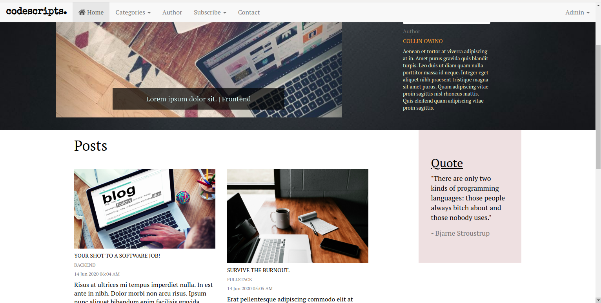

# codescripts
#### A blog website on software development, 15/06/2020
#### By [Collin Owino](https://github.com/Collin9726)

### [codescripts app](https://codescriptsblog.herokuapp.com/)

## Description

<table>
<tr>
<td>
Codescripts is a blog website. The landing page contains the author profile in brief and a list of blog articles written by the author, ordered by the most recent. A carousel of slides displays article pictures and links to the articles. Random quotes also appear on the page on every refresh.
 
A reader taps on an article to read it in full. They can react to the post by leaving a comment anonymously. Readers can also subscribe for email notifications whenever a new post is made. The author has admin privileges. They sign into the website and are able to make a new post, update/delete posts, edit profile, and delete comments.
</td>
</tr>
</table> 

#### Latest updated version is on 15th June 2020.

## Technologies used

1. Python v3.6
2. Flask 1.1.2
3. Postgres
4. SQLAlchemy
5. Flask-Bootstrap
6. HTML & CSS

## Development

The app has been developed with Flask 1.1.2. It uses PostgreSQL database and SQLAlchemy. Database migrations are tracked with ALembic. Email communication uses the Google SMTP server. The app is deployed on Heroku. It's source code is available on GitHub at https://github.com/Collin9726/codescripts

## Setup & Run instructions
- Install the dependencies listed on `requirements.txt`.
- Configure your app to include `SECRET_KEY`, `MAIL_USERNAME`, `MAIL_PASSWORD`, among other environment variables as listed in `start.sh.sample`
- Run your app on `development` config for debugging purposes.

To contribute to this project on any modules, follow these easy steps:

- Fork the repo
- Create a new branch in your terminal (git checkout -b improve-feature)
- Make appropriate changes in file(s)
- Add the changes and commit them (git commit -am "Improve App")
- Push to the branch (git push origin improve-app)
- Create a Pull request

## Support and contact details
For any queries, issues, ideas or concerns contact [Collin Owino](owino.collin@gmail.com). Your feedback is highly appreciated. 
### [License](LICENSE)
MIT license
Copyright (c) 2020 **Collin Owino**